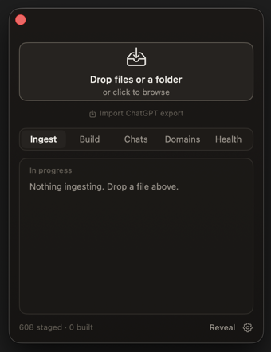

# Second Brain

A local-first macOS app that turns your notes, PDFs, and exported ChatGPT history into one linked Markdown wiki you can read in Obsidian and search from Claude or Cursor.

> Supported on macOS only.



## Highlights

- Brings handwritten notes, PDFs, and chat exports together into one searchable, cross-linked wiki.
- Incremental and versioned: a file you have already added is never reprocessed (each is matched by content hash), and the wiki lives in git, so every build is a checkpoint you can roll back.
- Runs on your Mac. Parsing, filtering, and search are local; only the wiki build uses a cloud model.
- Keeps cost down: it filters low-value chats and groups related ones before building, and you can cap spend per build.
- Reads as an Obsidian vault, with graph view, backlinks, and rendered math.
- Answers questions from Claude Desktop or Cursor: a built-in MCP server gives agents keyword and semantic search across your wiki.
- Can run unattended on a schedule, ingesting new material from watched folders.

## How it works

Second Brain watches a drop folder, converts anything you add into Markdown, and builds a wiki from it. Documents and chat exports take slightly different routes to get there.

A document you drop is already something you chose to keep, so it goes straight to the build. A ChatGPT export is bulk: most conversations are not worth keeping, and many cover the same ground. Chats are filtered and grouped first, so you do not pay to write throwaway or near-duplicate pages.

```
documents   drop -> parse --------------> build -> read
chats       drop -> parse -> filter -> group -> build -> read
```

The build is the only step that uses a paid model; everything before it is local. See [Architecture](docs/architecture.md) to understand each step in detail.

## Installation

### Prerequisites

- An Apple Silicon Mac (M1 or later) for running the local OCR model (Chandra 2) on MLX.
- About 16 GB of unified memory recommended. The local parsing and triage models use roughly 4–6 GB while running.
- About 10 GB of free disk for the Python dependencies and on-device models.
- [uv](https://github.com/astral-sh/uv) for the Python environment.
- The Swift toolchain to build the app (Xcode, or `xcode-select --install`).
- An Anthropic API key for wiki compilation. Enter it in the app's Settings (which writes a local `.env` for you), or add `ANTHROPIC_API_KEY=...` to a `.env` file at the repository root.
- (Optional) [Ollama](https://ollama.com) for chat triage + clustering, and MCP semantic search.

### Install

From the repository root:

```bash
./install.sh
```

This installs the Python dependencies, builds the menu bar app into `/Applications`, and creates the data folders under `~/second-brain/`. Most of the multi-gigabyte download is the on-device parsing models: Docling for typed PDFs and Chandra (a ~3 GB MLX OCR model) for handwriting and scans. If Ollama is installed, the `gemma3:4b` and `nomic-embed-text` models are pulled as well.

Without Ollama the pipeline still runs: chat filtering, grouping, and semantic search are skipped, and search falls back to keywords.

## First run

Open Second Brain from the menu bar, then:

1. Drop files or a folder onto the window, or copy them into `~/second-brain/drops/`. Parsing runs on its own and stays local.
2. When parsing finishes, review what is staged to build and its estimated cost. Remove anything you do not want in the wiki, or open a parsed `.md` to check how a file came through.
3. Click **Build wiki**. This is the only step that costs money. Set a per-build spend cap in Settings to keep it bounded.
4. Open `~/second-brain/wiki/` in Obsidian, or connect Claude Desktop or Cursor over MCP.

[Using the app](docs/using-the-app.md) is the full guide to the menu bar app.

## Supported sources

Drop any of these on the app, or copy them into `~/second-brain/drops/`:

- **PDFs** (`.pdf`) — typed, handwritten, scanned, or a mix. Pages are handled one at a time, so a handout with handwritten notes comes through intact.
- **Text** (`.md`, `.txt`, `.tex`) — passed through with light front matter added.
- **ChatGPT exports** — the `conversations.json` (or split `conversations-*.json`) from a ChatGPT data export. Drop the file or the unzipped folder; only the conversation data is kept.

> Only ChatGPT's own export format is supported. Exports from other assistants will not work.

Dragging onto the app sorts each file automatically. If you copy files in by hand, documents go in `drops/documents/` and a ChatGPT export goes in `drops/chatgpt/`.

## What you get

The wiki is plain Markdown under `~/second-brain/wiki/`:

- One page per topic, written and linked together with `[[wikilinks]]`.
- A home page that indexes the wiki, with overview pages that gather each subject area.
- Backlinks on every page, so you can see what refers to what.
- YAML front matter and rendered LaTeX where the content calls for it.

Because it is plain Markdown, it opens directly as an Obsidian vault, with graph view and backlinks. You can also connect it to Claude Desktop or Cursor over MCP to search and ask questions across your pages.


## Documentation
For deeper dives:

- [Using the app](docs/using-the-app.md) — the menu bar app, day to day.
- [Command line](docs/cli.md) — running the pipeline from the terminal.
- [Architecture](docs/architecture.md) — how the pipeline works and where data lives on disk.
- [Data lifecycle and deletion](docs/lifecycle.md) — hashing, caching, and what each kind of delete removes.

## License

Second Brain is licensed under the MIT License. See [LICENSE](LICENSE).
