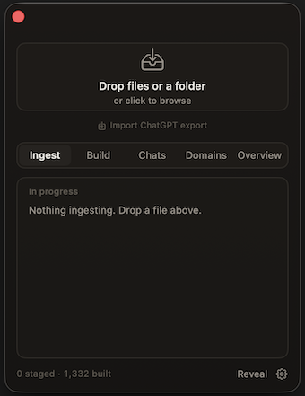
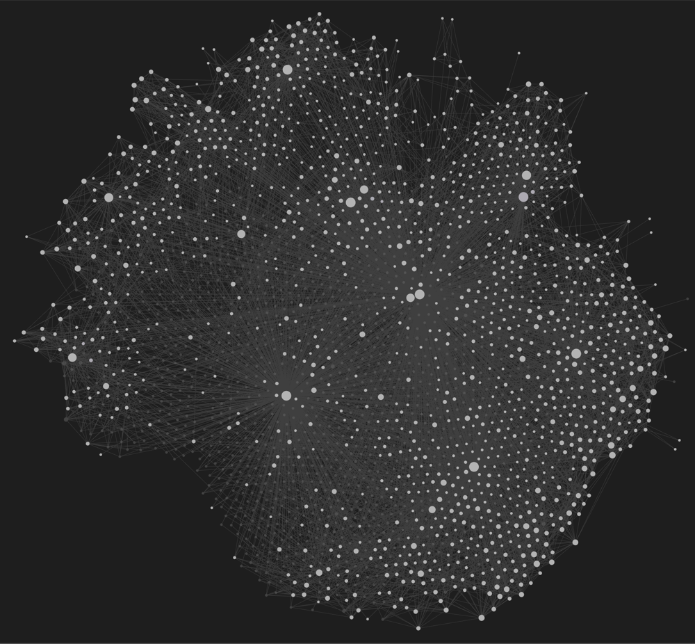
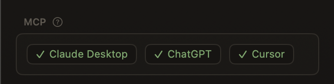

# Second Brain

**Second Brain** is a local-first macOS app that turns your PDFs, notes, and ChatGPT history into a structured, relational [Obsidian](https://obsidian.md/) knowledge base. Browse visually as an interconnected graph, or connect it to Claude Desktop, ChatGPT Desktop, or Cursor for deep, traversable context.

> Supported on macOS only.

<p align="center">
  
</p>

## Highlights

- **Structured compilation pipeline.** Second Brain equips its compilation agent with tools to inspect your existing wiki before writing. Instead of dumping isolated summaries, the agent checks what you already know, searches for existing pages, updates concepts with new evidence, and wires new topics into the broader graph with citations.
- **Relational graph with prerequisites.** Pages connect through bidirectional links, shared domains, and prerequisite relationships that document what should be understood/read before another.
- **MCP integration for agents.** A built-in MCP server connects your knowledge base directly to assistants like Claude Desktop, ChatGPT Desktop, and Cursor. When you ask questions, agents can navigate your actual notes, prerequisites, and source citations rather than improvising generic explanations. When you discover something new, the agent can also write notes back into the compilation queue to keep the wiki growing.
- **Curated taxonomy and health tracking.** The app tracks unwritten concepts (topics linked by existing pages that do not have their own note yet), orphan notes with no references, and potential duplicates. You can also rename, merge, or delete domain tags across the entire vault to keep your vocabulary focused.
- **Background monitoring and automatic intake.** Point the app at folders where you regularly save papers, slides, or notes. Second Brain watches them in the background, ingesting and staging them for compilation automatically.
- **Local parsing and bounded build cost.** Typed PDFs, scans, and handwritten notes are converted into clean Markdown locally on Apple Silicon for free. You can preview estimated compilation costs and set a hard dollar spend cap on every build.

## How it works

1. **Ingest**: Drop files into the app or save them into watched folders. Local parsing models extract clean Markdown on your Mac (including handwriting and layout OCR). When you import chat history, a local model filters out low-value chats and groups related conversations.
2. **Review**: Staged sources appear in the menu bar app with cost estimates. You can inspect parsed files, remove sources you do not want, or adjust conversation clusters.
3. **Compile**: A cloud model agent inspects your existing wiki to understand what you already know, updates existing concept pages with new material, adds new pages, and wires bidirectional links and prerequisites.
4. **Access**: The resulting pages update directly in Obsidian. Connected desktop agents (Claude, Cursor, ChatGPT) can query the graph through MCP and write new discoveries back.

```
documents   capture -> ingest ----------------------> compile -> access
chats       capture -> ingest -> triage -> cluster -> compile -> access
```

See [Architecture](docs/architecture.md) for how the pipeline and storage work under the hood.

## Installation

### Prerequisites

- An Apple Silicon Mac (M1 or later) with roughly 16 GB of unified memory recommended (local models use 4 to 6 GB while active).
- Around 10 GB of free disk space for dependencies and local models.
- [uv](https://github.com/astral-sh/uv) package manager.
- Xcode Command Line Tools (`xcode-select --install`).
- [Ollama](https://ollama.com) installed and running.

### Install

From the repository root:

```bash
./install.sh
```

This installs Python dependencies, builds the menu bar app into `/Applications`, sets up data directories under `~/second-brain/`, and downloads the required local models (`gemma4:12b` and `nomic-embed-text`).

You can verify Ollama status via the app's settings. Alternatively, to verify from a terminal:

```bash
uv run second-brain doctor
```

## First run

Open Second Brain from the menu bar:

1. Open Settings, select a cloud model for compilation, and add its corresponding API key. You can set a per-build spend cap to keep cloud costs bounded.
2. Select files to add into the knowledge base on the Ingest tab (or drag a file anywhere in the app window). These files will be parsed and subsequently staged for compilation.
3. Switch to the Build tab to review staged sources and estimated costs. You can inspect parsed files or remove anything you do not want to compile.
4. Click **Build wiki** to compile your staged sources into pages.
5. Open `~/second-brain/wiki/` in Obsidian, or connect Claude Desktop, ChatGPT Desktop, or Cursor over MCP.

See [Using the app](docs/using-the-app.md) for a complete walkthrough of the menu bar app.

## Supported sources

Drop any of these on the app, or copy them into `~/second-brain/drops/`:

- **PDFs** (`.pdf`): typed documents, handwritten notes, scans, or a mix. Individual pages are routed to OCR or layout parsers automatically.
- **Notes and text** (`.md`, `.txt`, `.tex`): Markdown notes, plain text files, and LaTeX source.
- **ChatGPT exports**: `conversations.json` or split export files from a ChatGPT data archive. Drop the file or unzipped folder directly; only conversation data is kept.

> Only ChatGPT's export format is supported. Exports from other assistants will not work.


## What you get

The knowledge base is stored at `~/second-brain/wiki/` as standard Markdown files. Open the folder as an Obsidian vault to explore:

- One page per topic written and filed by type into **concepts**, **problems**, **papers**, **projects**, or **insights**, linked together with `[[wikilinks]]`.
- YAML front matter on every page tracking prerequisite concepts to read first, relevant subject domains, and citations back to the files that produced them.
- Automatically generated navigation under `_views/`, including a home index, overview pages for each domain, and a list of unwritten concept gaps (`gaps.md`).
- Standard LaTeX math blocks and formatted tables that render natively in Obsidian.

<p align="center">
  
</p>

Connecting via MCP gives desktop agents access to the same graph. Assistants can search your notes by meaning or keyword, follow links across concepts, trace citations back to raw sources, and write new notes directly back into the vault. In Settings, click then refresh the corresponding assistant to install the Second Brain MCP. 

<p align="center">
  
</p>

See [Querying over MCP](docs/mcp.md) for more details and tool reference.

## Documentation

- [Using the app](docs/using-the-app.md): walk through day to day use of the menu bar app.
- [Command line](docs/cli.md): manage the pipeline and inspect vault status from the terminal.
- [Querying over MCP](docs/mcp.md): configure desktop AI clients and query tools.
- [Architecture](docs/architecture.md): pipeline execution model and on-disk layout.
- [Wiki structure](docs/wiki-structure.md): vault directory layout, metadata conventions, and link semantics.
- [Data lifecycle and deletion](docs/lifecycle.md): content hashing, caching, and recovery behavior.

## License

Second Brain is licensed under the MIT License. See [LICENSE](LICENSE).
